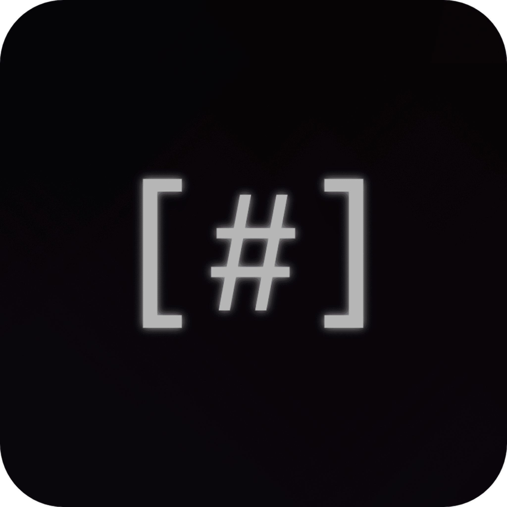

  

# Mounoa  

Mounoa Projesi bir Toplu Windows Toolkit'dir

> [!CAUTION]
> Kod TAM bitmedi ama çalışan yani 𝙆𝘼𝙍𝘼𝙍𝙇𝙄 sürümü bitti.

# Kurulum 🔨
> [Buradan]([example.com](https://github.com/Mav1zz/Mounoa/releases/tag/1.0.0)) gidip indirebilirsin. :D

Şimdilik `Windows` tabanlı sistemlerde çalışır.

Proje `Python` dilinde yazılmıştır. (açık kaynaklı :D)

PROJE TAM 1 YILDIR YAPMAYA ÇALIŞIYORUM (üşengecim :D)

# Yapımcılar:
>  ▪ ᴍᴀᴠɪᴢ: (Kod,Tasarım,Fikir)

## Ek Yapımcılar:
>  ▪ ᴄʜʀɪꜱᴛɪᴛᴜꜱᴛᴇᴄʜ: (Winutil)

>  ▪ ꜰᴜʀʏ999ɪᴏ: (CCTV)
